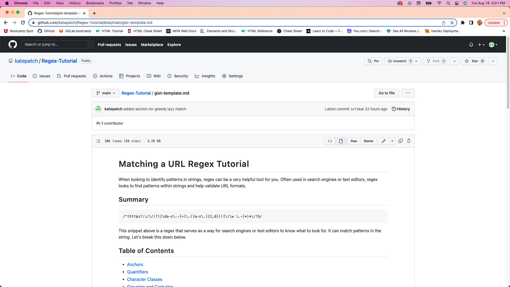

# Regex Tutorial

 Module 17 Challenge

## User Story

AS A web development student 
I WANT a tutorial explaining a specific regex 
SO THAT I can understand the search pattern the regex defines

## Acceptance Criteria

GIVEN a regex tutorial 
WHEN I open the tutorial 
THEN I see a descriptive title and introductory paragraph explaining the purpose of the tutorial, a summary describing the regex featured in the tutorial, a table of contents linking to different sections that break down each component of the regex and explain what it does, and a section about the author with a link to the author’s GitHub profile 
WHEN I click on the links in the table of contents 
THEN I am taken to the corresponding sections of the tutorial 
WHEN I read through each section of the tutorial<b/r>
THEN I find a detailed explanation of what a specific component of the regex does 
WHEN I reach the end of the tutorial 
THEN I find a section about the author and a link to the author’s GitHub profile

## Additional Info

Find this repo at: [Github](https://github.com/katepatch/Regex-Tutorial)

